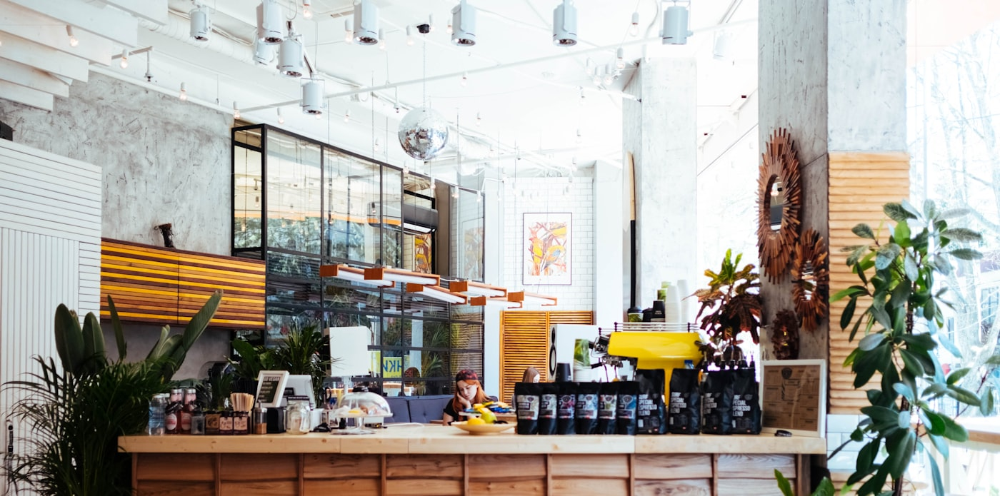

summary: 5강 - 성과물 제작 및 시각 표현 기법
id: digi-literacy1-05
categories: digital-literacy
tags: canva, gemini, chatgpt, portfolio, ai
status: Published
authors: quiet-classes
Feedback Link: https://github.com/damianospark/quiet-classes/issues/new

# 5강 | 성과물 제작 및 시각 표현 기법

## 오리엔테이션

Duration: 5

4강에서 완성한 전략 기획 산출물(Docs·Sheets·Slides)을 Canva와 LLM을 활용해 **취업 포트폴리오**로 시각화합니다. 단일 `콘텐츠 담당자` 관점에서 디자인·설명력·제출까지 완성하는 2시간 실습입니다.


### 🎯 학습 목표

1. Canva의 기본/AI 기능을 조합해 포트폴리오 레이아웃을 완성한다.
2. ChatGPT·Gemini로 설명 문구를 생성·개선하고 프롬프트 튜닝 기법을 익힌다.
3. AI 이미지 편집(증명사진 리터치)과 문서 분석 기능으로 설명 정확도를 높인다.
4. 4강 Notion 프로젝트 보드에 최종 산출물을 등록하고 담당 교수님께 제출한다.

### 실습 흐름


| 단계                  | 도구                    | 활동                                      | 산출물            | 담당자        |
| ----------------------- | ------------------------- | ------------------------------------------- | ------------------- | --------------- |
| 1. 환경 준비          | Canva, Notion           | 4강 프로젝트 보드 확인, 5강 Task 등록     | 5강 Task 목록     | 콘텐츠 담당자 |
| 2. Canva 기본 기능    | Canva                   | 템플릿·브랜드 키트·레이아웃 가이드 실습 | 브랜드 프리셋     | 콘텐츠 담당자 |
| 3. 섹션 구성          | Canva                   | 4페이지 레이아웃, 4강 Docs·Sheets 임베드 | 와이어프레임      | 콘텐츠 담당자 |
| 4. 프로필 사진 리터치 | Gemini / Qwen           | 비정장 사진 → 정장 톤 보정               | 프로필 이미지 PNG | 콘텐츠 담당자 |
| 5. 소개문 작성        | ChatGPT / Gemini        | 150자 소개문 초안 생성                    | 소개문 초안       | 콘텐츠 담당자 |
| 6. 프롬프트 튜닝      | ChatGPT / Gemini        | 톤 변환·시적 표현·간결화                | 톤별 소개문 3종   | 콘텐츠 담당자 |
| 7. 근거 기반 설명     | ChatGPT Vision / Gemini | 기획서·코드 분석 → 프로젝트 설명        | 프로젝트 설명문   | 콘텐츠 담당자 |
| 8. AI 기능 결합       | Canva                   | Magic Write, Magic Media, 번역            | AI 적용 버전      | 콘텐츠 담당자 |
| 9. 최종 조립          | Canva, Notion           | PDF 다운로드, Notion 등록                 | 포트폴리오 PDF    | 콘텐츠 담당자 |
| 10. 제출              | Notion                  | 품질 점검, 교수님 제출                    | Notion 공유 URL   | 콘텐츠 담당자 |

## 환경 준비 및 Notion 연동

Duration: 8

### 준비 체크리스트

1. ✅ [Canva 계정 로그인](https://www.canva.com/)하고 `홈 → 프로젝트`에서 `5강_포트폴리오` 폴더를 만든다.
2. ✅ Chrome에 Canva, [Gemini](https://gemini.google.com/), [ChatGPT](https://chatgpt.com/) 탭을 고정한다.
3. ✅ 4강에서 생성한 Notion `프로젝트 보드` 페이지를 열고 공유 링크를 확인한다.
4. ✅ 로컬 컴퓨터에 비정장 프로필 사진(정장 없이 촬영된 사진)을 준비한다.

### 5강 Task 등록

1. Notion `프로젝트 보드`에서 `+ 새 프로젝트`를 클릭하고 이름을 `5강 - 취업 포트폴리오 제작`으로 입력한다.
2. `Task Tracker`에서 `+ 새 행`을 눌러 아래 Task를 등록한다.


| Task 이름            | 상태   | 담당자        | 마감일 |
| ---------------------- | -------- | --------------- | -------- |
| Canva 기본 기능 실습 | 시작전 | 콘텐츠 담당자 | 오늘   |
| 포트폴리오 섹션 구성 | 시작전 | 콘텐츠 담당자 | 오늘   |
| 프로필 사진 리터치   | 시작전 | 콘텐츠 담당자 | 오늘   |
| 소개문 작성 & 튜닝   | 시작전 | 콘텐츠 담당자 | 오늘   |
| 프로젝트 설명 강화   | 시작전 | 콘텐츠 담당자 | 오늘   |
| 최종 조립 & 제출     | 시작전 | 콘텐츠 담당자 | 오늘   |

3. `프로젝트 보드`에서 `5강 - 취업 포트폴리오 제작` 행을 클릭하고 `Task Tracker`와 Relation을 맺는다.

### 성과물

- 5강 Task가 등록된 Notion 프로젝트 보드 스크린샷

<보완필요: Notion 프로젝트 보드에 5강 Task가 등록된 화면 캡처>

## Canva 기본 기능 점검 (AI 적용 전)

Duration: 12

<aside class="info">
<strong>왜 Canva인가?</strong> Canva는 AI 이전에도 <strong>템플릿 필터</strong>, <strong>브랜드 키트</strong>, <strong>레이아웃 가이드</strong>, <strong>버전 기록</strong> 기능으로 비전문 디자이너도 빠르게 포트폴리오를 제작할 수 있었습니다. 이를 선행 학습하면 AI 기능 적용 시에도 결과물을 일관되게 유지할 수 있습니다.
</aside>



### 실습 절차

1. ✅ Canva 홈에서 `디자인 만들기 → 프레젠테이션 (1920×1080)`을 선택한다.
2. ✅ 왼쪽 `템플릿` 패널에서 `포트폴리오`를 검색하고 `스타일` 필터로 `미니멀`, `모던`, `크리에이티브` 중 하나를 선택한다.
   - **추천 템플릿**: "Modern Portfolio", "Creative Resume", "Professional Portfolio"
3. ✅ 마음에 드는 템플릿을 클릭하고 `템플릿 사용`을 눌러 복제한다.
4. ✅ 상단 `디자인 → 브랜드 키트`를 열고 `브랜드 색상`에 본인의 대표 색상 3개를 등록한다.
   - 예: 주색상(#2C3E50), 보조색상(#3498DB), 강조색상(#E74C3C)
5. ✅ `브랜드 폰트`에서 `Pretendard`, `Noto Sans KR`, `Roboto` 중 하나를 선택한다.

<aside class="warning">
<strong>Pretendard 폰트 다운로드 방법</strong>: Canva에서 Pretendard를 찾을 수 없다면, <a href="https://github.com/orioncactus/pretendard/releases" target="_blank">Pretendard GitHub Releases</a>에서 최신 버전을 다운로드하세요. 압축 해제 후 <code>Pretendard-Regular.otf</code> 파일을 더블클릭해 시스템에 설치하면, Canva Pro 계정에서 <code>업로드 → 폰트 업로드</code>로 사용할 수 있습니다. 무료 계정은 시스템 폰트 중 <code>Noto Sans KR</code>을 대체 사용하세요.
</aside>

6. ✅ 캔버스 상단 `파일 → 설정 → 눈금자 및 가이드 표시`를 체크하고, 그 아래 `가이드 추가`를 클릭해 그리드·안전 영역을 활성화한다.

### 성과물

- 브랜드 컬러·폰트가 적용된 Canva 템플릿 복제본
- Task Tracker에서 `Canva 기본 기능 실습` 상태를 `완료`로 변경


## 포트폴리오 섹션 구성

Duration: 18

1. ✅ Canva 상단 `파일 → 새로운 디자인 만들기`를 선택한 후 `A4 문서`를 클릭해 포트폴리오 페이지를 생성한다.
2. ✅ `페이지 추가`를 클릭해 총 1~2페이지를 구성한다.
   - **페이지 1**: 인트로, 역량, 성과, 컨텍 포인트 를 넣고 불량이 많아지면 2페이지를 생성하여 배치한다.
   - **인트로**: 프로필 사진 + 소개
   - 역량 : 자신이 작성했던 이력서나 자기소개서에서 역량과 관련 된 내용을 정리해 넣는다.
   - 성과 : 자신이 작성했던 이력서나 자기소개서에서 자신의 성과를 정리해 넣는다. 가급적 수치화한 데이터를 넣는 것이 중요. 가능하다면 차트를 넣는 것도 심사위원에게 깊은 인상을 줌.
   - 컨택 포인트 : 이메일, GitHub, LinkedIn
3. ✅ 각 페이지에서 `스타일 → 모든 페이지에 적용`을 클릭해 브랜드 컬러·폰트를 일괄 적용한다.
4. ✅ 역량의 내용을 준비하기 어렵다면, 페이지 2에서 `요소 → 선 & 모양 → 프레임`을 드래그해 4강에서 만든 Google Docs 링크를 임베드한다.
   - 4강 Docs 링크를 복사하고 Canva 프레임에 붙여넣는다.
   - `임베드 → 링크 미리보기`를 선택해 문서 썸네일을 표시한다.
5. ✅ 성과의 내용을 준비하기 어렵다면 페이지 2 에서 `앱 → Google Drive → 연결`을 클릭하고 4강에서 만든 Google Sheet를 선택한다.
   - `삽입 → 차트 → 시트에서`를 클릭하고 KPI 차트를 가져온다.
   - 차트 크기를 조정하고 `사용자 지정 → 범례`에서 글씨체를 브랜드 폰트로 변경한다.
6. ✅ 페이지 4에서 `텍스트 → 본문 추가`를 클릭하고 이메일·GitHub·LinkedIn 링크를 입력한다.

### 실습 팁

- `Command + Shift + K`(macOS) 또는 `Ctrl + Shift + K`(Windows)로 선택 요소들을 `자동정렬`하면 섹션 간 여백이 일정해진다.
- `주석` 기능(`C` 키)을 활용해 나중에 교정할 곳(예: 숫자 업데이트)을 메모해둔다.

### 성과물

- 4페이지 와이어프레임 PNG Export (`파일 → 다운로드 → PNG`)
- `버전 기록`에 `20250109_Layout` 명명
- Task Tracker에서 `포트폴리오 섹션 구성` 상태를 `완료`로 변경

<보완필요: Canva 4페이지 레이아웃 와이어프레임 캡처>

## 프로필 사진 리터치 (Gemini nanobannana / Qwen Image Edit)

Duration: 12


<aside class="info">
<strong>증명사진이 없다면?</strong> 정장 없이 촬영한 사진이나 넥타이 없이 찍은 사진을 Gemini nanobanana 또는 Qwen Image Edit로 리터치해 포트폴리오용 프로필 사진으로 활용할 수 있습니다.
</aside>

### 실습 절차

1. ✅ 로컬 컴퓨터에서 비정장 프로필 사진을 준비한다.
2. ✅ [Gemini Advanced](https://gemini.google.com/)를 열고 `이미지 업로드`를 클릭해 사진을 업로드한다.
   - Qwen Image Edit를 사용하려면 [Qwen 공식 사이트](https://qwenlm.github.io/)에서 Image Edit 모델을 선택한다.
3. ✅ 아래 프롬프트를 입력해 포트폴리오용 증명사진을 생성한다.

```
정장 없이 촬영한 이 사진을 취업 포트폴리오용으로 보정해줘.
- 남색/진회색 재킷을 입힌 것처럼 보이게 하고
- 자연스러운 단색 배경(밝은 회색)을 적용해줘.
- 목 부분에는 얇은 V넥 니트를 자연스럽게 유지해, 넥타이는 추가하지 말아줘.
```

4. ✅ 추가 개선이 필요하면 다음 후속 프롬프트를 사용한다.

```
턱선과 어깨선을 약간 또렷하게 강조하고, 피부 톤은 자연광에서 촬영한 것처럼 보정해줘.
과도한 뷰티 필터 효과는 제거하고, 사진 전체 밝기는 10%만 올려줘.
```

5. ✅ 결과물을 PNG로 다운로드하고 `포트폴리오_프로필_20250109.png`로 저장한다.
6. ✅ Canva 페이지 1(인트로)에서 `업로드 → 파일 업로드`를 클릭하고 리터치한 프로필 사진을 추가한다.
7. ✅ 프로필 사진을 프레임에 맞춰 삽입한 뒤 `사진 편집 → 그림자`로 입체감을 준다.

### 성과물

- 보정된 프로필 사진 PNG
- Canva 페이지 1에 적용 완료
- Task Tracker에서 `프로필 사진 리터치` 상태를 `완료`로 변경

<보완필요: Gemini/Qwen 리터치 전후 비교 이미지>

## LLM으로 소개문 초안 작성

Duration: 10


1. ✅ [ChatGPT](https://chatgpt.com/) 또는 [Gemini](https://gemini.google.com/)를 열고 아래 프롬프트를 입력한다.

```
대상: 경영학 전공 3학년, AI 서비스 기획 직무 지원자.
목표: Canva 포트폴리오 첫 페이지에 들어갈 150자 내외 소개문 작성.
조건: 핵심 역량 3개(데이터 분석, 사용성 검증, 팀 협업)와 4강 프로젝트 성과(KPI 개선 25%)를 포함해줘.
톤: 신뢰감 있고 간결하게.
```

2. ✅ 출력된 결과를 복사해 [Grammarly](https://www.grammarly.com/) 등으로 일차 교정한다.
3. ✅ Canva 페이지 1에서 `텍스트 → 본문 추가`를 클릭하고 소개문을 붙여넣는다.
4. ✅ 서체를 `Pretendard / 14pt`로 변경하고 브랜드 컬러를 적용한다.

### 성과물

- 소개문 초안 (150자 내외)
- Canva 페이지 1에 텍스트 블록 적용 완료

## 프롬프트 튜닝으로 문체 다듬기

Duration: 12

1. ✅ ChatGPT/Gemini에서 아래 프롬프트를 입력해 톤을 변환한다.

```
방금 작성한 소개문을 더 따뜻한 어조로 바꿔줘.
- 주요 성과 수치는 유지
- 문장 길이는 평균 22자로 조정
- 끝맺음을 지원 직무에 대한 확신으로 마무리
```

2. ✅ 시적 표현을 추가하는 프롬프트로 반복 실습한다.

```
이번에는 같은 내용을 3문장으로 요약하되,
- 첫 문장은 인상적인 비유
- 두 번째 문장은 구체적 성과
- 세 번째 문장은 앞으로의 포부
로 구성해줘.
```

3. ✅ 간결 버전을 만들고 싶다면 다음을 사용한다.

```
동일한 소개문을 90자 이내, 레쥬메에 어울리는 건조한 어조로 작성해줘.
중요 수치는 유지하고 접속사는 최소화해.
```

4. ✅ 3가지 버전(따뜻한 어조, 시적 표현, 간결 버전)을 Notion `포트폴리오 재료` 페이지에 기록한다.
5. ✅ Canva 페이지 1에 최종 선택한 소개문을 적용한다.

### 성과물

- 톤별 소개문 3종
- Notion `포트폴리오 재료` 페이지에 문체 선택 이유 기록
- Task Tracker에서 `소개문 작성 & 튜닝` 상태를 `완료`로 변경

<보완필요: ChatGPT 프롬프트 튜닝 전후 비교 스크린샷>

## 이미지·문서 분석 기반 설명 강화

Duration: 18

1. ✅ [ChatGPT Vision](https://chatgpt.com/) 또는 [Gemini Advanced](https://gemini.google.com/)를 열고 다음 중 하나를 업로드한다.
   - Canva 초안 PDF
   - 4강 프로젝트 기획서 (Google Docs PDF)
   - GitHub 코드 ZIP (있을 경우)
2. ✅ 다음 프롬프트로 근거 기반 설명을 생성한다.

```
업로드한 문서를 기반으로, 포트폴리오 '프로젝트 소개' 섹션에 넣을 5문장 설명을 작성해줘.
- 각 문장은 [결과 : 사용 도구 : 나의 기여] 구조를 따라 작성
- 문장마다 문서에서 찾은 구체적 근거(숫자, 기능명)를 괄호 안에 표기
- 마무리 문장은 다음 확장 계획 제안
```

3. ✅ 결과가 모호하면 후속 프롬프트를 입력한다.

```
세 번째 문장이 추상적이야. 업로드한 자료 중 Sheets KPI 값과 연계해 수치형 근거를 추가해줘.
```

4. ✅ 출력 텍스트를 Canva 페이지 2에서 `표` 또는 `리스트` 요소로 정리한다.
   - `요소 → 표 → 3×2`를 선택해 표를 만든다.
   - 첫 번째 열에 `결과`, 두 번째 열에 `사용 도구`, 세 번째 열에 `나의 기여`를 입력한다.
   - LLM이 생성한 문장을 각 셀에 붙여넣는다.

### 성과물

- 근거가 각주로 표시된 프로젝트 설명문
- LLM 분석 과정 스크린샷 (Notion `포트폴리오 재료` 페이지에 업로드)
- Task Tracker에서 `프로젝트 설명 강화` 상태를 `완료`로 변경

<보완필요: ChatGPT Vision/Gemini 문서 분석 결과 스크린샷>

## Canva AI 기능 결합

Duration: 8

1. ✅ Canva 페이지 2에서 `텍스트 → Magic Write`를 클릭하고 슬라이드별 소제목을 자동 생성한다.
   - 예: "핵심 역량", "프로젝트 성과", "사용 도구"
2. ✅ `요소 → Magic Media → 이미지 편집`을 클릭하고 포트폴리오 배경 그래픽을 AI로 생성한다.
   - 프롬프트 예: "미니멀한 기하학 패턴, 파란색 톤, 비즈니스 포트폴리오용"
   - 생성된 이미지를 페이지 1 배경에 배치하고 투명도를 20%로 조정한다.
3. ✅ `앱 → 번역`을 클릭하고 소개문을 영어·일본어 2개 언어로 자동 번역한다.
   - 번역된 텍스트를 페이지 4 하단에 추가한다.
4. ✅ `파일 → 버전 기록 → 현재 버전 이름 지정`을 클릭하고 `20250109_AI-Enhanced`로 저장한다.

### 성과물

- AI 적용 버전의 Canva 링크
- 생성된 배경 그래픽/다국어 페이지

<보완필요: Canva Magic Write/Magic Media 실행 화면 캡처>

## 최종 조립 & 내보내기

Duration: 8


1. ✅ Canva 우측 상단 `공유 → 링크 있는 모든 사용자 → 보기 가능`으로 설정하고 URL을 복사한다.
2. ✅ `다운로드 → PDF 표준`을 선택해 `portfolio_ai_20250109.pdf`로 저장한다.
3. ✅ Notion `프로젝트 보드`에서 `5강 - 취업 포트폴리오 제작` 행을 클릭하고 `Attach file` 속성에 Canva 링크와 PDF 파일을 업로드한다.
4. ✅ `완료 시각` 속성에 현재 날짜·시간을 입력하고 `상태`를 `완료`로 변경한다.

### 성과물

- 디지털 포트폴리오 PDF
- Canva 공유 링크 (Notion·지원 채널용)
- Task Tracker에서 `최종 조립 & 제출` 상태를 `완료`로 변경

<보완필요: Notion 프로젝트 보드에 Canva 링크·PDF가 등록된 화면 캡처>

## 품질 점검 & 교수님 제출

Duration: 5

1. ✅ 소개문·프로젝트 설명에서 사용한 수치와 4강 KPI 값이 일치하는지 검토한다.
2. ✅ 리터치한 프로필 사진에 과도한 보정 흔적이 없는지, 윤리 지침을 준수했는지 확인한다.
3. ✅ Canva에서 `파일 → 미리보기 → 모바일`을 열어 가독성을 확인한다.
4. ✅ LLM 생성 문장을 [Grammarly](https://www.grammarly.com/) 등으로 최종 교정한다.
5. ✅ Notion `프로젝트 보드` 공유 링크를 복사하고 담당 교수님께 이메일로 전달한다.
   - 제목: `[5강 제출] 취업 포트폴리오 완성본 - 이름`
   - 본문: Notion 공유 URL + Canva 링크 + PDF 첨부

### 성과물

- 품질 점검 완료 체크리스트
- 담당 교수님께 제출 완료 이메일 스크린샷

<보완필요: 교수님께 제출하는 이메일 템플릿 예시>

## 확장 미션 (선택)

Duration: 1

- 포트폴리오에 30초 분량 `Canva → 비디오` 버전을 추가 제작해 소셜용으로 공유
- Gemini로 프로젝트 산출물 요약 인포그래픽을 생성해 마지막 페이지에 삽입
- ChatGPT로 예상 면접 Q&A 카드를 작성하고 Canva로 카드 템플릿을 제작

확장 미션은 선택 과제로, 제출 시 별도 피드백을 받을 수 있습니다.
